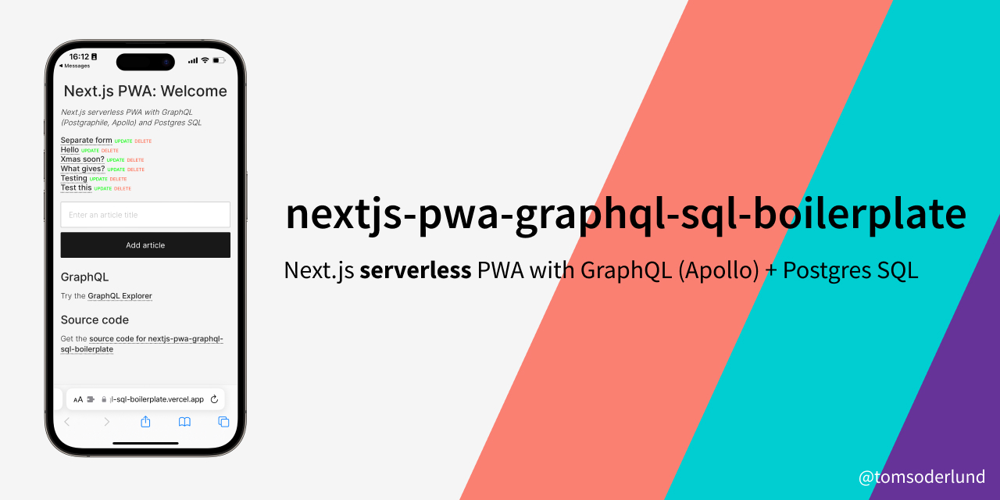

# Next.js serverless PWA with GraphQL (Apollo) and Postgres SQL boilerplate

_Note: this is my v3 boilerplate for React web apps. See also [nextjs-sql-rest-api-boilerplate](https://github.com/tomsoderlund/nextjs-sql-rest-api-boilerplate) and [nextjs-express-mongoose-crudify-boilerplate](https://github.com/tomsoderlund/nextjs-express-mongoose-crudify-boilerplate)._

## Why is this awesome?

This is a great template for a any project where you want **React (with Hooks)** (with server-side rendering, powered by [Next.js](https://github.com/zeit/next.js)) as frontend and **GraphQL and Postgres SQL** as backend.
_Lightning fast, all JavaScript._

* Great starting point for a [PWA (Progressive Web App)](https://en.wikipedia.org/wiki/Progressive_web_applications).
* Both front-end client and GraphQL/SQL server in one project.
* **NEW: Can be deployed as [serverless functions on Zeit Now](#deploying-serverless-on-zeit-now).**
* A fast Postgres SQL database server.
* [GraphQL API](#graphql-client-and-server) with Apollo.
* React Hooks for business logic.
* PWA features such as `manifest.json` and offline support (`next-offline`).
* Easy to style the visual theme using CSS (e.g. using [Design Profile Generator](https://tomsoderlund.github.io/design-profile-generator/)).
* `sitemap.xml` and `robots.txt` support.
* Google Analytics and `google-site-verification` support (see `config/config.js`).
* Flexible configuration with `config/config.js` and `.env` file.
* Hot reloading with `nodemon`.
* Unit testing with Jasmine (`yarn unit`).
* Code linting and formatting with StandardJS (`yarn lint`/`yarn fix`).

## Demo

See [**nextjs-pwa-graphql-sql-boilerplate** running on Zeit Now here](https://nextjs-pwa-graphql-sql-boilerplate.tomsoderlund.now.sh/).

## How to use

Clone this repository:

    git clone https://github.com/tomsoderlund/nextjs-pwa-graphql-sql-boilerplate.git [MY_APP]

Remove the .git folder since you want to create a new repository

    rm -rf .git

Install dependencies:

    cd [MY_APP]
    yarn  # or npm install

Install Postgres and set up the database:

    psql postgres  # Start the Postgres command-line client
    
    CREATE DATABASE "nextjs-pwa-graphql-sql";  -- You can also use \connect to connect to existing database
    \connect "nextjs-pwa-graphql-sql";
    CREATE TABLE article (id serial, title varchar(200), content text);  -- Create a blank table
    INSERT INTO article (title) VALUES ('The first article');  -- Add example data
    SELECT * FROM article;  -- Check data exists
    \q

Start it by doing the following:

    export DATABASE_URL=[your Postgres URL]  # Or use a .env file
    yarn dev

In production:

    yarn build
    yarn start

If you navigate to `http://localhost:3123/` you will see a web page with a list of articles (or an empty list if you haven’t added one).

### GraphQL client and server

Your GraphQL API server is running at `http://localhost:3123/api/graphql`.
[Try the GraphQL playground](https://nextjs-pwa-graphql-sql-boilerplate.tomsoderlund.now.sh/api/graphql) on the demo server.

## Deploying

You can either deploy as a [serverless deployment](https://zeit.co/docs/v2/serverless-functions/introduction/), or as a traditional Express server.

Depending on which deployment you make, some files are unnecessary*.

### Deploying serverless (on Zeit Now)

Develop with:

    now dev --listen 3123  # or: yarn now

Deploy to Now with:

	now  # or: yarn deploy

*Unnecessary files:

- `apollo-server-express` module
- `/graphql/schema.js`
- `/server` folder

(Shortcut: `yarn remove apollo-server-express; rm graphql/schema.js; rm -rf server`)

### Deploying as Express server (on Heroku)

    heroku create [MY_APP]
    heroku addons:create heroku-postgresql:hobby-dev
    git push heroku master

*Unnecessary files:

- `/api` folder
- `apollo-server-micro` module

(Shortcut: `yarn remove apollo-server-micro; rm -rf api`)

## Modifying the app to your needs

### Change app name

Do search/replace for "nextjs-pwa-graphql-sql-boilerplate" AND "nextjs-pwa-graphql-sql" to something else.

Change name in `public/manifest.json`

### Renaming “Article” to something else

The database item is called “Article”, but you probably want something else in your app.

Rename the files:

    mkdir graphql/{newName}
    mv graphql/article/queries.js graphql/{newName}/queries.js
    mv graphql/article/resolvers.js graphql/{newName}/resolvers.js
    mv graphql/article/schema.js graphql/{newName}/schema.js
    rm -r graphql/article
    mv hooks/useArticle.js hooks/use{NewName}.js
    mkdir -p pages/{newName}s/_components
    mv "pages/articles/[article].js" "pages/{newName}s/[{newName}].js"
    mv pages/articles/_components/ArticleList.js pages/{newName}s/_components/{NewName}List.js
    mv pages/articles/_components/ArticleListItem.js pages/{newName}s/_components/{NewName}ListItem.js
    mv pages/articles/_components/ArticleDetails.js pages/{newName}s/_components/{NewName}Details.js
    rm -r pages/articles

Then, do search/replace inside the files for different casing: article, Article, ARTICLE

### Change port number

Do search/replace for "3123" to something else.

### How to remove/replace SQL database

1. `graphql/schema.js`: remove `pg`
2. `graphql/article/resolvers.js`: remove “sql*” references

### Change visual theme (CSS)

1. Change colors in `public/manifest.json`
2. Change CSS in `public/app.css`
3. Change font in `PageHead.js`
